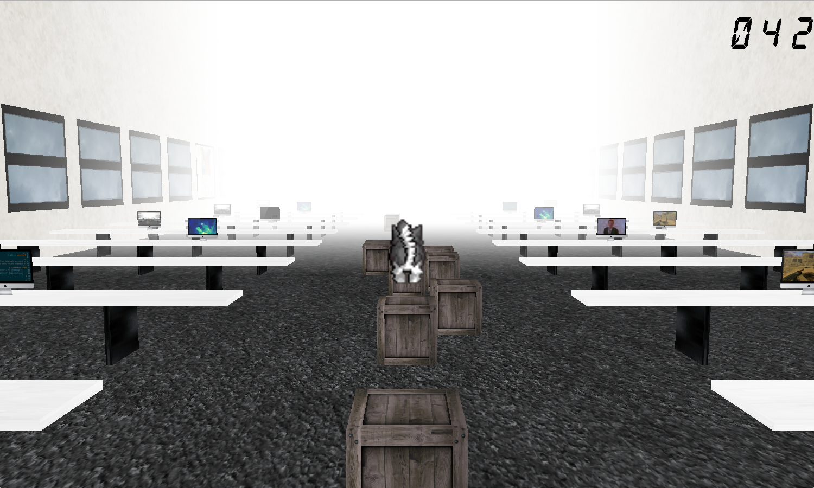
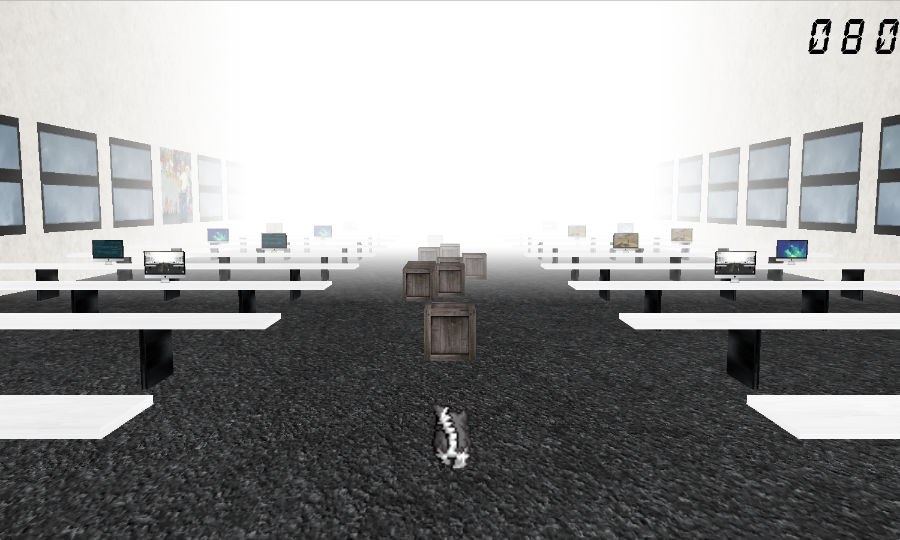
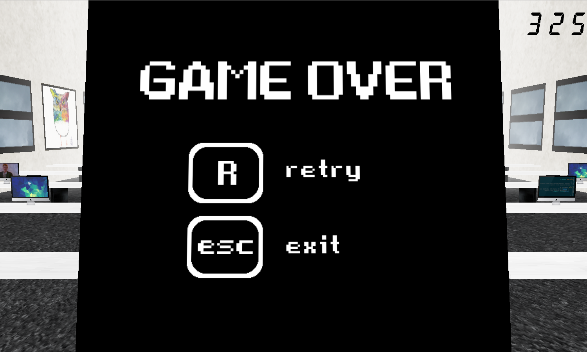

# 42run

A Temple Run-like game made with OpenGL.

## Libraries

* OpenGL 4.1
* OpenGL Mathematics (glm)
* GL Framework (GLFW)
* Simple OpenGL Image Library (SOIL)

## Usage

In your terminal:  
```sh
git clone https://github.com/4quet/42run.git
cd 42run
make
```
  
Launch using:  
`./42run`

### Key bindings

* **Left Arrow**: Move left.
* **Right Arrow**: Move right.
* **SPACE**: Jump.
* **P**: Toggle pause.
* **R**: Restart.
* **ESCAPE**: Quit.

## Screenshots




